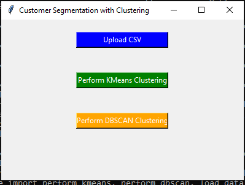

# ClusterMinds: Customer Segmentation Toolkit

**ClusterMinds** is an unsupervised machine learning project aimed at customer segmentation using clustering techniques. The tool applies **KMeans** and **DBSCAN** to segment customers based on their behavior. The GUI allows users to upload data, apply clustering, and visualize results.

## Features
- **Data Preprocessing**: Clean the data, handle missing values, and normalize features.
- **Clustering Techniques**: Use **KMeans** and **DBSCAN** to cluster the data.
- **Model Evaluation**: Evaluate clustering performance using the **Elbow Method** and **Silhouette Score**.
- **2D and 3D Visualization**: Visualize the clusters in a 2D and 3D space.
- **User Interface**: Simple **Tkinter** GUI to allow users to upload datasets, select clustering algorithms, and view results.

## Project Setup

### 1. Clone the repository
To get started with this project, first clone the repository to your local machine:

```bash
git clone https://github.com/your-username/ClusterMinds_Customer_Segmentation_Toolkit.git
```

### 2. Install Dependencies

The project requires several Python libraries. Install them using `requirements.txt`:

```bash
pip install -r requirements.txt
```

Here is a list of required dependencies:

- **pandas**: For data manipulation.
- **scikit-learn**: For machine learning algorithms (KMeans, DBSCAN).
- **matplotlib**: For data visualization.
- **tkinter**: For creating the GUI.

### 3. Running the Application

To run the project, execute the following command:

```bash
python titanic_gui.py
```

This will launch the Tkinter GUI, where you can upload the dataset and perform clustering.

## Detailed Explanation of Steps

### Step 1: Loading the Dataset

We start by loading the dataset. In this case, we use a sample dataset of mall customers (assumed to be in CSV format).

```python
import pandas as pd
data = pd.read_csv('mall_customers.csv')  # Replace with your dataset path
```

### Step 2: Data Preprocessing

**Data preprocessing** is crucial to ensure that the data is clean and ready for clustering. This step involves:

- **Handling missing values**: Filling missing values with the mean or median.
- **Feature normalization**: Normalizing numerical values to have a standard scale. We use **StandardScaler** or **MinMaxScaler** for this.

```python
from sklearn.preprocessing import StandardScaler

# Handling missing values
data = data.fillna(data.mean())

# Normalizing data
scaler = StandardScaler()
scaled_data = scaler.fit_transform(data[['Age', 'Annual Income (k$)', 'Spending Score (1-100)']])
```

- **Why fill missing values?**: Clustering algorithms may not perform well with missing data. Replacing missing values ensures the model can proceed without errors.
- **Why normalize features?**: Features such as `Age`, `Annual Income`, and `Spending Score` may be on different scales. Normalizing them ensures that each feature contributes equally to the clustering process.

### Step 3: KMeans Clustering

We use **KMeans** clustering to divide customers into distinct groups. The **Elbow Method** is used to determine the optimal number of clusters.

#### KMeans Implementation:
```python
from sklearn.cluster import KMeans
import matplotlib.pyplot as plt

# Elbow Method to find the optimal number of clusters
wcss = []
for i in range(1, 11):
    kmeans = KMeans(n_clusters=i, init='k-means++', max_iter=300, n_init=10, random_state=42)
    kmeans.fit(scaled_data)
    wcss.append(kmeans.inertia_)

plt.plot(range(1, 11), wcss)
plt.title('Elbow Method')
plt.xlabel('Number of Clusters')
plt.ylabel('WCSS')
plt.show()
```

- **Why use the Elbow Method?**: The Elbow Method helps us identify the point where adding another cluster does not significantly improve the model. This "elbow" is often the optimal number of clusters.
  
#### KMeans Model Fitting:
```python
# Apply KMeans with the chosen number of clusters
kmeans = KMeans(n_clusters=4, init='k-means++', max_iter=300, n_init=10, random_state=42)
kmeans_labels = kmeans.fit_predict(scaled_data)
```

- **Why choose 4 clusters?**: Based on the Elbow Method, we choose the number of clusters where the curve flattens. In this case, it suggests 4 clusters.

### Step 4: DBSCAN Clustering

**DBSCAN** (Density-Based Spatial Clustering of Applications with Noise) is another clustering technique that works well for data with noise or clusters of varying shapes.

```python
from sklearn.cluster import DBSCAN

# DBSCAN Clustering
dbscan = DBSCAN(eps=0.5, min_samples=5)
dbscan_labels = dbscan.fit_predict(scaled_data)
```

- **Why DBSCAN?**: Unlike KMeans, DBSCAN does not require specifying the number of clusters beforehand. It can identify clusters of arbitrary shapes and deal with noise in the data.

### Step 5: Evaluating the Model

We evaluate the clustering models using the **Silhouette Score**.

```python
from sklearn.metrics import silhouette_score

# Silhouette Score for KMeans
kmeans_score = silhouette_score(scaled_data, kmeans_labels)

# Silhouette Score for DBSCAN
dbscan_score = silhouette_score(scaled_data, dbscan_labels)
```

- **Why Silhouette Score?**: The Silhouette Score measures how similar an object is to its own cluster compared to other clusters. A higher score indicates better-defined clusters.

### Step 6: Visualizing Clusters

#### 2D Visualization:
We can visualize the results of the clustering in a 2D space using `matplotlib`.

```python
import matplotlib.pyplot as plt

plt.scatter(scaled_data[:, 0], scaled_data[:, 1], c=kmeans_labels, cmap='viridis')
plt.title('KMeans Clustering')
plt.xlabel('Age')
plt.ylabel('Annual Income')
plt.show()
```

- **Why visualize the clusters?**: Visualizing clusters helps us understand the patterns in the data. The plot will show how well the clusters are formed.

#### 3D Visualization (optional):
For a more comprehensive visualization, we can use **3D** plotting.

```python
from mpl_toolkits.mplot3d import Axes3D
from matplotlib import cm

fig = plt.figure()
ax = fig.add_subplot(111, projection='3d')

ax.scatter(scaled_data[:, 0], scaled_data[:, 1], scaled_data[:, 2], c=kmeans_labels, cmap=cm.viridis)
ax.set_title('3D KMeans Clustering')
ax.set_xlabel('Age')
ax.set_ylabel('Annual Income')
ax.set_zlabel('Spending Score')
plt.show()
```

### Step 7: Comparing Results

Finally, we compare the results of the KMeans and DBSCAN clustering models by evaluating the **Silhouette Scores**.

- **Why compare models?**: This comparison helps us determine which clustering algorithm provides better results for the given data.

### Step 8: GUI Implementation

The final step is integrating everything into a **Tkinter** GUI, where the user can interact with the model:

1. Upload the CSV file.
2. Choose between **KMeans** or **DBSCAN** clustering.
3. View the clustering results and plots.

The GUI code was already included above and is ready to use!

## Screenshot

Here is a screenshot of the GUI:



## Conclusion

This project demonstrates the power of **unsupervised learning** for customer segmentation. By applying KMeans and DBSCAN, we can uncover hidden patterns in customer behavior. The interactive GUI makes it easy for users to apply clustering without needing to code.


### Explanation of Key Terms:

- **KMeans**: A clustering algorithm that partitions data into a predefined number of clusters by minimizing the variance within each cluster.
- **DBSCAN**: A density-based clustering algorithm that identifies clusters of varying shapes and can detect noise in the data.
- **Elbow Method**: A technique used to determine the optimal number of clusters for KMeans by finding the "elbow" point in the plot of WCSS (Within-Cluster Sum of Squares).
- **Silhouette Score**: A measure of how well-defined the clusters are. A higher value indicates better-defined clusters.
- **Unsupervised Learning**: A type of machine learning where the algorithm is provided with data but not labeled outcomes. It tries to find hidden patterns in the data.

